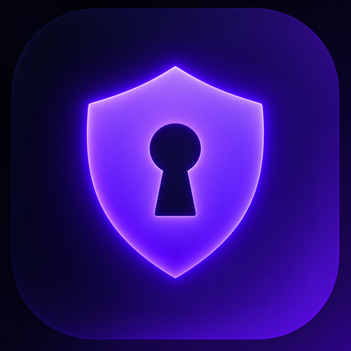

# NOVA-V2RAYN

<div align="center">
  
  <h3>⚡️ NOVA-V2RAYN · Advanced GUI Client for Windows</h3>
  <p>A modern, high-performance Xray & sing-box GUI client tailored with the bespoke <b>NOVA Cyberpunk Dark Theme</b>.</p>

  [](#)
  [](#)
  [](#)
  [](#)
</div>

---

## 🇮🇷 معرفی فارسی (Persian Overview)

**NOVA-V2RAYN** نسخه اختصاصی و بهینه‌سازی‌شده کلاینت قدرتمند ویندوز برای مدیریت اتصالات و کانفیگ‌های Xray و Sing-box است که با هویت بصری مدرن و نئون سایبرپانک **NOVA-X-PANEL** شخصی‌سازی شده است.

### ویژگی‌های کلیدی:
* 🌌 **طراحی بصری نئون سایبرپانک (Cyberpunk OLED):** پس‌زمینه دارک اختصاصی با های‌لایت‌های نئونی فیروزه‌ای (`#00F0FF`) و بنفش، جایگزین تم متریال ساده.
* ⚡️ **رنگ‌بندی هوشمند پینگ و تأخیر:** نمایش سبز زمردی (`#00E676`) برای سرورهای سریع، فیروزه‌ای برای پینگ متوسط، کهربایی برای پینگ بالا و قرمز نئونی برای تایم‌اوت‌ها.
* 🛡 **پشتیبانی کامل از پروتکل‌های پیشرفته:** VLESS (Reality / XTLS-Vision), VMess, Trojan, Shadowsocks, Hysteria 2, TUIC v5.
* 🔒 **پشتیبانی بومی از ECH و Clean IP:** عبور پایدار از فیلترینگ و اختلالات اینترنت.
* ⚙️ **سازگار با TUN Mode:** تونل‌سازی کامل ترافیک سیستم‌عامل ویندوز با یک کلیک.
* 🚀 **بیلد خودکار و مستقل:** مجهز به اکشن‌های GitHub جهت انتشار آسان نسخه‌های جدید.

---

## 🇬🇧 Features & Highlights

* **Deep Obsidian & Neon Aesthetic:** Engineered with high-contrast OLED dark backgrounds, frosted glass card styling, and electric cyan accents.
* **Smart Latency Telemetry:** Instant color-coded ping indicators (<300ms Emerald, <600ms Cyan, <1000ms Amber, Red Timeout).
* **Multi-Core Power:** Native integration with both **Xray-core** and **sing-box**.
* **Zero Adware / Clean Build:** All external promotional URLs and tracking links completely stripped.
* **Seamless Updates:** Integrated updater directly linked to the `NOVA-X-PANEL/NOVA-V2RAYN` GitHub release channel.

---

## 📥 دانلود و نصب (Download)

فایل‌های آماده برای اجرا را از بخش **[Releases](https://github.com/NOVA-X-PANEL/NOVA-V2RAYN/releases)** دانلود نمایید:

1. فایل زیپ `NOVA-V2RAYN-windows-64.zip` را دانلود و استخراج (Extract) کنید.
2. برنامه `v2rayN.exe` را اجرا کنید.
3. لینک اشتراک یا کانفیگ‌های خود را اضافه کرده و متصل شوید!

---

## 🛠 توسعه و کامپایل دستی (Build from Source)

نیازمندی‌ها:
* [.NET 10.0 SDK](https://dotnet.microsoft.com/download/dotnet/10.0) یا جدیدتر
* ویندوز ۱۰ نسخه ۱۹۰۴۱ یا بالاتر

```bash
# کلون ریپازیتوری
git clone https://github.com/NOVA-X-PANEL/NOVA-V2RAYN.git
cd NOVA-V2RAYN/v2rayN

# بیلد نسخه ویندوز x64
dotnet publish ./v2rayN/v2rayN.csproj -c Release -r win-x64 -p:SelfContained=true -p:EnableWindowsTargeting=true -o ./dist/win-x64
```

---

## 📜 لایسنس (License)

پروژه تحت لایسنس عمومی **GNU General Public License v3.0 (GPL-3.0)** منتشر شده است.
مبتنی بر سورس پایه پروژه متن‌باز [2dust/v2rayN](https://github.com/2dust/v2rayN).
